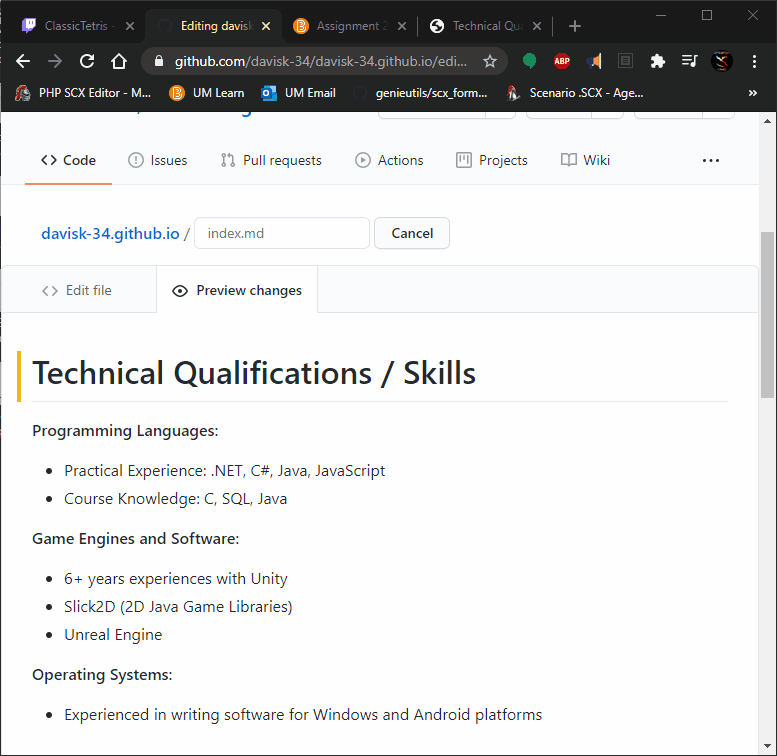

## Hosting your resume on Github Pages   and learn principles of good technical communication along the way

Github Pages is a great way to host a resume or simple website. It's cost-free, ad-free, and very easy to use. In this readme I will explain the steps to hosting your resume with Github Pages. I will also explain a few principles of good technical communication.  These principles are found in the collapsible sections for clarity. If you want to learn more about technical communication, I highly recommend Andrew Etter's book [Modern Technical Writing](https://www.amazon.ca/Modern-Technical-Writing-Introduction-Documentation-ebook/dp/B01A2QL9SS).

  
Tech Comm Note 1: Benefits of a static webpage

  
*Andrew Etter is a big advocate for storing technical documents (like resumes) on static websites. This allows the document to be easily updated and prevents readers from ever seeing an out-dated version of the document. For example, if you have a new job to add to your resume, just update the webpage. Every job you have applied to will automatically have access to you up-to-date resume.*

### Step 1: Create/Log-in to you Github account
- Create a Github account, if you don't have one already. It is a simple process, just like signing up for any other site.

  
Tech Comm Note 2: Consider your audience

  
 *As you think about the document you are about to write, consider the audience. This is the most important step, as it will define what you can assume the reader will already know. This is very relevent to a resume. If you are applying for a comp sci job, you can assume the hiring manager will know technical lingo, allowing you omit basic explanations and keep your resume concise.*

### Step 2: Create a new repository called [username].github.io
- Click  to create a new repository.
The repository's name MUST be named [username].github.io.
This creates a special repo that contains a Github Page. 
 
Then, click "Create Repository" at the bottom of the page.
Once the repo is made, you will be sent to a Quick Setup page. 

  
Tech Comm Note 3: Be concise

  
 *Reading technical writing is a chore. And as such, people tend to skim the text, spending as little time with it as possible. For this reason, it is important to be clear, to-the-point and prevent including superfluous information. Use tables, headings, and list to construct an easy-to-read document. If possible, your headings should give the reader all they need to know to continue on to the next step.*

### Step 3: Create a new file called "index.md"
Click on  and name the file "index.md". This is a markdown file that will be displayed when you visit [username].github.io from a web browser. It works exactly like an index.html, except is it a markdown file.

If you need a refresher on github flavored markdown, here is [a great resource](https://github.com/adam-p/markdown-here/wiki/Markdown-Cheatsheet).

  
Tech Comm Note 4: Don't write XML or HTML

  
 *Use a simple markup language like Markdown to expedite the creation process. These tools were specifically create to allow us to avoid writing native XML or HTML. They allow us to focus more on the content and less on the technical act of creating a webpage.*

### Step 4: Pick a Jekyll theme
In the repo settings, there is a section called Github Pages that lets you configure some aspects of your page. Most importantly, there is a "Change Theme" button that opens a new page of themes for you to browse and select from. These are Jekyll themes. Jekyll is a web software that processes Markdown code and converts it to customizable HTML.  This is what allows our standard Markdown code to appear as an attractive website.  For more information on Jekyll check out [Barry Clark's blog](https://www.smashingmagazine.com/2014/08/build-blog-jekyll-github-pages/). Once you have picked a theme, return to the main page of your repo and click on "index.mb" to start creating your resume.

### Step 5: Start creating!
Now you have a webpage that natively supports markdown! Github's preview feature lets you switch back and forth from code to preview, to see what your page looks like. It's important to note that any custom css will not be displayed in the preview window, so it is a good idea to have your new website open in a separate tab. You can see this in action in the image below.

  
Tech Comm Note 5: Basic Function Document

  
 *The idea of a Basic Functional Document (BFD) is one that explains just enough to get the job done. A BFD will answer the following questions:*

- What is the product?
- Why would anyone want it?
- Does it have dependencies?
- Where can I get it?
- How do I install it?
- How do I complete a simple task?

 

### More Resources
- [Markdown Tutorial](https://github.com/adam-p/markdown-here/wiki/Markdown-Cheatsheet)
- [Jekyll Info](https://www.smashingmagazine.com/2014/08/build-blog-jekyll-github-pages/)
- [Modern Technical Writing](https://www.amazon.ca/Modern-Technical-Writing-Introduction-Documentation-ebook/dp/B01A2QL9SS)

### FAQs

- *I updated my index file, but why isn't the change showing up on my website?* 
The time it takes for your webpage to reflect your changes can be as long as 10 minutes and as short as 10 seconds. Also, remember that you need to commit any changes to you file with the "Commit Changes" button at the bottom of the editing window.

- *What other tasks can I use markdown for?* 
You can use markdown in blogs, emails and some group messaging applications like Discord. There are also services that will convert markdown to PDF, effectively allowing you to ship Markdown documentation with your software.

Proof readers: Aaron Salo, Kyle Lamoureux, Tianlei Wang, Sheikh Shafayet Hossain 
Theme: https://github.com/pages-themes/cayman
~

